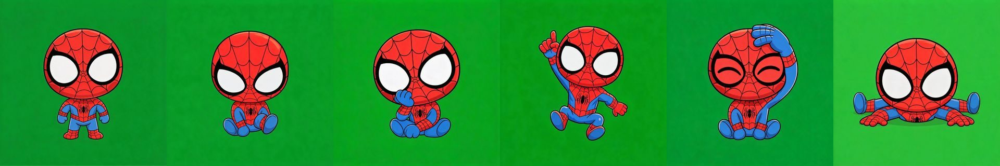

# dsh-plugins

DeepSeek Harness（dsh）插件集 · v0.2

在 DeepSeek Harness 的 web 界面里增加**漫威英雄桌宠**与**英雄皮肤**能力的插件仓库。皮肤与桌宠采用**英雄内容模型**：运行时与英雄数据分离，设置里可以独立组合（例如蜘蛛侠皮肤 + 钢铁侠桌宠）。当前已上线第一个英雄——蜘蛛侠；钢铁侠、美国队长等按同一模型扩展。



## 包含的插件

| 包名 | 说明 |
| --- | --- |
| `@deepseek-ai/dsh-spider-pet` | 漫威桌宠运行时 + 英雄内容（当前：蜘蛛侠 Peter Parker） |
| `@deepseek-ai/dsh-client-ui-skin-spiderman` | 漫威皮肤运行时 + 英雄主题（当前：蜘蛛侠红蓝） |

### 🕷️ dsh-spider-pet 漫威桌宠

- **状态动画**：待机呼吸、等待踢脚、思考托腮、欢呼跳跃、摸头享受、沮丧趴地，跟随对话状态自动切换（收到用户消息 → 等待，开始推理 → 思考，调用工具 → 显示工具名，回合结束 → 欢呼，回合出错 → 沮丧）
- **点击互动**：单击桌宠触发跳跃欢呼并显示“嗷呜～”气泡；双击摸头，播放享受动画并给出气泡反馈
- **拖拽移动**：按住桌宠可拖到屏幕任意位置
- **右键面板**：快捷隐藏桌宠，隐藏后可通过“召唤”按钮找回
- **命名**：桌宠名跟随所选英雄（当前为 Peter Parker）
- **设置中心**：在「设置 → 插件 → 漫威」中一键总开关，并独立选择**皮肤英雄**与**桌宠英雄**，选择即时热切换（桌宠位置/大小保留）
- **渲染**：精灵图帧动画，通过 canvas 逐帧绘制，避免巨幅背景图在部分 GPU 上合成时的花屏/截断问题

### 🎨 dsh-client-ui-skin-spiderman 漫威皮肤

- **红蓝主题**：通过覆盖官方设计令牌（design tokens）实现全局红蓝蜘蛛侠配色，左右工作区与对话区样式统一变更
- **全局细节**：滚动条、选区、聚焦环、链接配色均跟随红蓝主题；左侧工作区叠加细蛛网纹理与角落蜘蛛标水印，新建会话按钮带红蓝渐变描边
- **工作区场景化**：左侧工作区铺战衣红色纹理底（深色遮罩保证可读性），会话列表呈玻璃卡片质感、选中项红蓝渐变描边与光晕；顶部蜘蛛徽标 + SPIDER-MAN/WORKSPACE 装饰，底部 Peter Parker 在线状态条，折叠侧栏或关闭皮肤时自动隐藏/移除
- **设置弹框**：设置面板带红蓝描边光晕与顶部渐变细线、电影感遮罩；左侧 tab 选中项红色边缘条；插件清单卡片红蓝渐变底 + 悬停微光；蜘蛛侠卡片带蜘蛛标小预览图
- **对话区背景交互**：右侧对话区背景为**真人 Peter Parker** 与**蜘蛛战衣**双图层，鼠标移动会产生流体墨水效果——鼠标扫过之处从战衣中显现出真人形象
- 该背景交互效果**借鉴自抖音博主「白日梦想家AI」**的作品及其公开的蜘蛛侠交互式网站（WebGL 稳定流体实现）

## 技术要点

- 桌宠采用精灵图（sprite sheet）帧动画 + canvas 渲染；状态由 host 的 session 事件驱动（`turn/start` / `tool/call` / `turn/end` / `user/message`）
- 皮肤主题通过 CSS 变量覆盖官方设计令牌；对话区背景流体效果为 WebGL2 stable-fluids（splat → curl → pressure → advection）逐帧求解
- 英雄内容模型：`HeroPetContent`（精灵图/帧表/名字）与 `HeroSkinContent`（令牌主题/背景效果/徽标/文案）数据驱动运行时；皮肤与桌宠通过 `localStorage`（`dsh.marvel.v1`）+ 自定义事件共享总开关与选择，即时生效并跨标签页同步
- 纯前端渲染，素材（精灵图、人物/战衣抠图）以数据或资源形式打包在插件内，不依赖外部服务

## 安装到自己的 DeepSeek Harness

### 环境要求

- 已安装 DeepSeek Harness（`dsh`，v0.1）
- Node.js 18+、pnpm

### 安装步骤

1. 克隆本仓库并构建插件：

   ```bash
   git clone git@github.com:ZTuTZ/dsh-plugins.git
   cd dsh-plugins
   pnpm install
   pnpm build
   ```

2. 编辑 web profile 的 `package.json`（默认路径 `~/.dsh/profiles/web/package.json`）：

   在 `dependencies` 中加入两个插件的本地路径依赖，并在 `dsh.profile.bundles` 中注册它们：

   ```json
   {
     "name": "dsh-profile-web",
     "private": true,
     "dsh": {
       "profile": {
         "bundles": [
           "@deepseek-ai/dsh-base",
           "@deepseek-ai/dsh-web-app",
           "@deepseek-ai/dsh-spider-pet",
           "@deepseek-ai/dsh-client-ui-skin-spiderman"
         ]
       }
     },
     "dependencies": {
       "@deepseek-ai/dsh-spider-pet": "link:/你的路径/dsh-plugins/packages/dsh-spider-pet",
       "@deepseek-ai/dsh-client-ui-skin-spiderman": "link:/你的路径/dsh-plugins/packages/dsh-skin-spiderman"
     }
   }
   ```

   也可以使用命令替代第 2 步的依赖部分（bundle 列表仍需按上面手动确认）：

   ```bash
   dsh plugin --profile web add /你的路径/dsh-plugins/packages/dsh-spider-pet
   dsh plugin --profile web add /你的路径/dsh-plugins/packages/dsh-skin-spiderman
   ```

3. 在 profile 目录安装依赖：

   ```bash
   cd ~/.dsh/profiles/web && pnpm install
   ```

4. 重启 `dsh web`，打开「设置 → 插件 → 蜘蛛侠」，开启总开关即可看到桌宠与皮肤。

> 提示：如果刷新后没有生效，请确认 `dsh.profile.bundles` 已包含上面两个包名——只有加入 bundle 列表的插件才会被加载。

## 未来规划（v0.2+）

- 新英雄：钢铁侠（战甲着装背景交互 + Q 版桌宠）、美国队长（盾牌星芒 + Q 版桌宠）等
- 皮肤与桌宠的自由组合（已支持，随英雄内容逐步丰富）
- 英雄素材按需加载，控制首屏 bundle 体积
- 更丰富的桌宠状态与互动

## 致谢

- 对话区背景的流体交互效果**借鉴自抖音博主「白日梦想家AI」**的作品及其蜘蛛侠交互式网站
- 蜘蛛侠相关形象素材由 AI 生成，仅用于个人学习与演示
